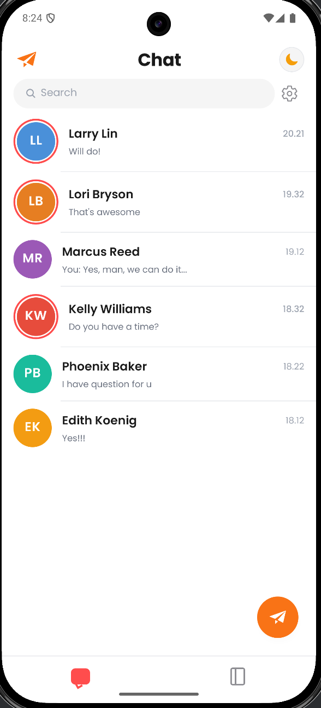
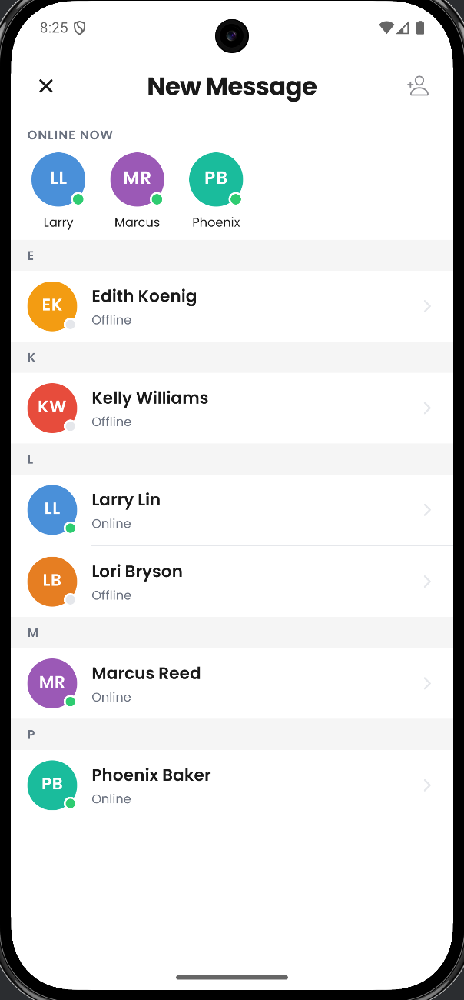
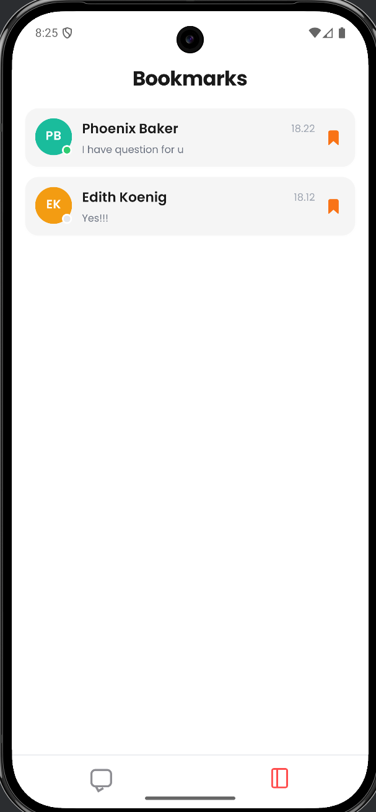
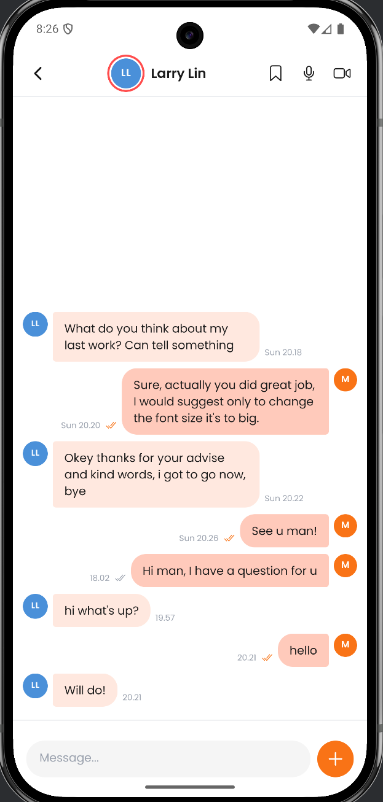

# ChatApp

A frontend-only React Native chat messaging app built with Expo, inspired by modern messaging UX (WhatsApp / iMessage aesthetic). Built with TypeScript, React Navigation, and a custom context-based state store.


## Screenshots

| Chat List | New Message | Bookmarks | Conversation |
|:---------:|:-----------:|:---------:|:------------:|
|  |  |  |  |

---

## Demo

▶ [Watch demo video](WhatsApp%20Video%202026-04-27%20at%208.32.23%20PM.mp4)

> **Tip:** To embed the video directly on GitHub, open a new issue or PR, drag-and-drop the `.mp4` file into the comment box, copy the generated `https://github.com/user-attachments/...` URL, then replace the link above with:
> ```
> 
> ```

---

| Layer | Library |
|---|---|
| Framework | React Native + Expo SDK 54 |
| Language | TypeScript (strict) |
| Navigation | React Navigation v7 (native stack + bottom tabs) |
| State | React Context + useReducer |
| Persistence | @react-native-async-storage/async-storage |
| Icons | @expo/vector-icons (Ionicons + Entypo) |
| Fonts | @expo-google-fonts/poppins |
| Attachments | expo-image-picker |

---

## Prerequisites

- Node.js 18+
- npm or yarn
- Expo CLI (`npm install -g expo-cli`)
- For Android: Android Studio + emulator, or a physical device with Expo Go
- For iOS: Xcode (macOS only), or a physical device with Expo Go

---

## Getting Started

### 1. Install dependencies

```bash
cd app
npm install
```

### 2. Run on Android (native build — recommended)

```bash
npx expo run:android
```

> This compiles the native Android project. An emulator must be running or a device must be connected via USB.

### 3. Run on iOS (macOS only)

```bash
npx expo run:ios
```

### 4. Run in Expo Go (quick preview)

```bash
npx expo start
```

Then scan the QR code with the Expo Go app on your device.

> **Note:** `expo-image-picker` (camera/library access) requires a native build (`run:android` / `run:ios`) to work fully. Expo Go may restrict camera permissions.

---

## Project Structure

```
app/
├── App.tsx                         # Root — fonts, providers, navigation container
├── src/
│   ├── constants/
│   │   ├── colors.ts               # Brand color tokens
│   │   ├── typography.ts           # Poppins font styles
│   │   ├── theme.ts                # Spacing, Radius, Shadow tokens
│   │   └── index.ts                # Barrel export
│   ├── types/
│   │   └── index.ts                # All TypeScript interfaces
│   ├── data/
│   │   └── mockData.ts             # 6 mock contacts + pre-seeded conversations
│   ├── store/
│   │   ├── ChatContext.tsx          # Global chat state (useReducer + AsyncStorage)
│   │   └── ThemeContext.tsx         # Light/dark theme state
│   ├── navigation/
│   │   ├── RootNavigator.tsx        # Root stack (MainTabs + Conversation + SelectContact)
│   │   └── BottomTabNavigator.tsx   # 2-tab bar (Chat List + Bookmarks)
│   ├── screens/
│   │   ├── ChatScreen.tsx           # Chat list (Tab 1)
│   │   ├── ConversationScreen.tsx   # Individual chat view
│   │   ├── ContactsScreen.tsx       # New message / contact picker (via FAB)
│   │   └── BookmarksScreen.tsx      # Saved conversations (Tab 2)
│   └── components/
│       ├── Common/
│       │   ├── Avatar.tsx           # Initials avatar with online dot + ring
│       │   ├── SearchBar.tsx        # Reusable search input
│       │   └── ThemeToggle.tsx      # Sun/moon dark mode toggle button
│       ├── ChatScreen/
│       │   └── ChatListItem.tsx     # Single row in the chat list
│       └── ConversationScreen/
│           ├── MessageBubble.tsx    # Chat bubble with ticks, images, files
│           └── MessageInput.tsx     # Text input + attachment button
```

---

## Features

### Core Requirements

#### User Selection
- Tap the FAB (paper-plane button) on the Chat screen to open the **New Message** screen
- Browse all contacts in an alphabetical A–Z section list
- Tap any contact to open an existing conversation or create a new one

#### Real-Time Chat (Simulated)
- Messages appear instantly in the conversation without any page refresh
- Each contact has a pool of reply strings — a simulated reply arrives 1.5–3 seconds after you send
- State is managed entirely with `useReducer`; no external libraries

#### Persistence
- All conversations and bookmarks are saved to device storage via `AsyncStorage`
- Data is restored automatically on every app launch
- Storage key: `@chat_conversations_v1`

#### Attachments
- Tap the **+** button in the message input to attach a photo
- Choose from **Photo Library** or **Camera**
- Images render inline inside the message bubble
- **50 MB file size limit** — an alert is shown if the selected file exceeds this

#### FAB (Floating Action Button)
- Orange paper-plane FAB fixed to the bottom-right of the Chat List screen
- Navigates to the Contact Picker as a slide-up modal stack screen

### Bonus Requirements

#### Timestamps
- Every message shows a timestamp **outside** the bubble
- Format: `6.22` (today), `Mon 5.10` (earlier this week)
- Outgoing: timestamp sits to the left of the bubble
- Incoming: timestamp sits to the right of the bubble

#### Read Indicators (WhatsApp-style)
All outgoing messages cycle through four states automatically:

| Icon | Colour | Meaning |
|---|---|---|
| Clock (`time-outline`) | Grey | Sending… |
| Single tick (`checkmark`) | Grey | Sent |
| Double tick (`checkmark-done`) | Grey | Delivered |
| Double tick (`checkmark-done`) | Orange | Read |

Transitions: `sending` → `sent` (300 ms) → `delivered` (900 ms) → `read` (on simulated reply).

### Extra Features

#### Dark / Light Mode
- Sun/moon toggle button in the top-right corner of the Chat screen
- Switches **all screens and components** simultaneously
- Full dark palette: dark backgrounds, dimmed bubbles, adjusted text colours
- `StatusBar` style updates automatically

#### Bookmarks
- Tap the **bookmark icon** in any conversation header to save it
- Saved conversations appear in the **Bookmarks tab** (second tab)
- Tap a bookmark card to jump back into that conversation
- Tap the filled bookmark icon again to remove it

#### Search
- Live search bar on the Chat List screen filters conversations by contact name

#### Unread Indicator
- A coral-coloured ring appears around the contact avatar when there are unread messages
- Disappears automatically when you open the conversation

#### Online Status
- Green dot indicator on avatars for online contacts
- **"Online Now"** horizontal strip at the top of the Contact Picker screen

---

## Known Behaviour

- **Simulated read receipts:** Every sent message eventually gets `read` ticks because the simulated reply always triggers the `read` status transition. In a real app this would be driven by a server event.
- **Camera on Expo Go:** Camera access may be restricted in Expo Go. Use `npx expo run:android` for full native functionality.
